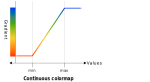

# Colormaps

## OmfContinuousColormap

```c
typedef struct {
    double min;
    double max;
    const OmfArray *gradient;
} OmfContinuousColormap;
```

A continuous colormap linearly samples a color gradient within a defined range.

A value X% of way between `min` and `max` should use the color from X% way down gradient. When that X doesn't land directly on a color use the average of the colors on either side, inverse-weighted by the distance to each.

Values below the minimum use the first color in the gradient array. Values above the maximum use the last.



### Fields

min: `double`
: Minimum value.

max: `double`
: Maximum value.

gradient: [`const OmfArray *`](arrays.md#omfarray)
: Gradient array.

### Methods

#### omf_continuous_colormap_init

```c
OmfContinuousColormap omf_continuous_colormap_init(double min, double max,
                                                   const OmfArray *gradient);
```

Initializes or resets a continuous colormap struct.


## OmfIntegerContinuousColormap

```c
typedef struct {
    int64_t min;
    int64_t max;
    const OmfArray *gradient;
} OmfIntegerContinuousColormap;
```

The same as [`OmfContinuousColormap`](#omfcontinuouscolormap) except that the min and max are
`uint64_t` so they can be precise across the full range of possible values.


## OmfDiscreteColormap

```c
typedef struct {
    const OmfArray *boundaries;
    const OmfArray *gradient;
} OmfIntegerContinuousColormap;
```

A discrete colormap divides the whole number line into non-overlapping ranges and gives a color to each range.
To calculate the color $c$ from the value $v$, boundaries $b$, and gradient $g$:

$$
c = \left\{
    \begin{array}{ll}
        g_0 & \quad \text{if } v < b_0 \\
        g_1 & \quad \text{if } b_0 \le v < b_1 \\
        \vdots & \quad \vdots \\
        g_n & \quad \text{if } b_{n-1} \le v < b_n \\
        g_{n+1} & \quad \text{if } v \ge b_n \\
    \end{array}
\right.
$$

The inclusive array contains boolean values that, if true, change the match from $<$ to $\le$,
so values exactly equal to the boundary will use the color of the range below it rather than above.
Its length must match the length of the boundaries array,
or it can be omitted in which case all matches are exclusive.

The color gradient array must be one element longer than boundaries,
with the extra color used for values above the last boundary.

### Fields

boundaries: [`const OmfArray *`](arrays.md#omfarray)
: Boundary array giving the value and inclusive flag for the edges of each discrete range,
in increasing order.
The boundary number type should match the number attribute type.
Values must increase along the array.

gradient: [`const OmfArray *`](arrays.md#omfarray)
: Gradient array.
Must have length one larger than `boundaries`,
with the extra color being used for values above the last boundary.

### Methods

#### omf_discrete_colormap_init

```c
OmfDiscreteColormap omf_discrete_colormap_init(const OmfArray *boundaries,
                                               const OmfArray *inclusive,
                                               const OmfArray *gradient);
```

Initializes or resets a discrete colormap struct.
