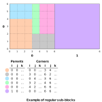

# Block Model

## OmfBlockModel

```c
typedef struct {
    OmfOrient3 orient;
    const OmfRegularGrid3 *regular_grid;
    const OmfTensorGrid3 *tensor_grid;
    const OmfRegularSubblocks *regular_subblocks;
    const OmfFreeformSubblocks *freeform_subblocks;
} OmfBlockModel;
```

A 3D grid or block model.
Block sizes can be regular or tensor,
and may have regular or free-form sub-blocks inside each parent block.

Valid attribute location are `OMF_LOCATION_VERTICES` for per-corner data,
`OMF_LOCATION_BLOCKS` for data on parent block or at parent block centroids,
or `OMF_LOCATION_SUBBLOCKS` for sub-blocks or sub-block centroids.

### Attribute Locations

- [`Vertices`](crate::Location::Vertices) puts attribute values on the corners of the
  parent blocks. If the block count is $(N_0, N_1, N_2)$ then there must be
  $(N_0 + 1) · (N_1 + 1) · (N_2 + 1)$ values. Ordering increases U first, then V, then W.

- [`Blocks`](crate::Location::Primitives) puts attribute values on the centroids of the
  parent block. If the block count is $(N_0, N_1, N_2)$ then there must be
  $N_0 · N_1 · N_2$ values. Ordering increases U first, then V, then W.

- [`Subblocks`](crate::Location::Subblocks) puts attribute values on sub-block centroids.
  The number and values and their ordering matches the `parents` and `corners` arrays.

    To have attribute values on undivided parent blocks in this mode there must be a sub-block
    that covers the whole parent block.

### Fields

orient: `OmfOrient3 `
: Contains the position and orientation.

regular_grid: [`const OmfRegularGrid3*`](../grids.md#OmfRegularGrid3)
tensor_grid: [`const OmfTensorGrid3*`](../grids.md#OmfTensorGrid3)
: Exactly one of these must be non-null, defining a grid with either regular or varied spacing.

regular_subblocks: [`const OmfRegularSubblocks*`](#OmfRegularSubblocks)
freeform_subblocks: [`const OmfFreeformSubblocks*`](#OmfFreeformSubblocks)
: One or none may be non-null, defining either regular or free-form the sub-blocks.

### Methods

#### omf_block_model_init

```c
OmfBlockModel omf_block_model_init(void);
```

Initializes or resets a block model struct.


## OmfRegularSubblocks

```c
typedef struct {
    uint32_t count[3];
    const OmfArray *subblocks;
    OmfSubblockMode mode;
} OmfRegularSubblocks;
```

Divide each parent block into a regular grid of `count` cells.
Sub-blocks each covers a non-overlapping cuboid subset of that grid.

Sub-blocks are described by the `parents` and `corners` arrays.
Those arrays must be the same length and matching rows in each describe the same sub-block.
Each row in `parents` is an IJK index on the block model grid.
Each row of `corners` is $(i_{min}, j_{min}, k_{min}, i_{max}, j_{max}, k_{max})$,
all integers, that refer to the *vertices* of the sub-block grid within the parent block.
For example:

- A block with minimum size in the corner of the parent block would be (0, 0, 0, 1, 1, 1).
- If the `subblock_count` is (5, 5, 3) then a sub-block covering the whole parent would be (0, 0, 0, 5, 5, 3).

Sub-blocks must stay within their parent,
must have a non-zero size in all directions, and should not overlap. Further restrictions can be applied by the `mode` field,
see [`OmfSubblockMode`](#omfsubblockmode) for details.



### Fields

count: `uint32_t[3]`
: The maximum number of sub-blocks in each direction.

subblocks: [`const OmfArray*`](../arrays.md#omfarray)
: Regular sub-block array giving the parent block index and min/max corners of each sub-blocks.

mode: [`OmfSubblockMode`](#omfsubblockmode)
: Describes any extra restrictions on the sub-block layout.


### Methods

#### omf_regular_subblocks_init

```c
OmfRegularSubblocks omf_regular_subblocks_init(uint32_t nu,
                                               uint32_t nv,
                                               uint32_t nw,
                                               const OmfArray *parents,
                                               const OmfArray *corners);
```

Initializes or resets a regular sub-blocks struct.


## OmfFreeformSubblocks

```c
typedef struct {
    const OmfArray *subblocks;
} OmfFreeformSubblocks;
```

Divide each parent block into any number and arrangement of non-overlapping cubiod regions.

Sub-blocks are described by the `parents` and `corners` arrays.
Each row in `parents` is an IJK index on the block model grid.
Each row of `corners` is $(i_{min}, j_{min}, k_{min}, i_{max}, j_{max}, k_{max})$
in floating-point and relative to the parent block,
running from 0.0 to 1.0 across the parent.
For example:

- A sub-block covering the whole parent will be (0.0, 0.0, 0.0, 1.0, 1.0, 1.0) no matter the size of the parent.
- A sub-block covering the bottom third of the parent block would be (0.0, 0.0, 0.0, 1.0, 1.0, 0.3333)
and one covering the top two-thirds would be (0.0, 0.0, 0.3333, 1.0, 1.0, 1.0),
again no matter the size of the parent.

Sub-blocks must stay within their parent, must have a non-zero size in all directions, and shouldn't overlap.

### Fields

subblocks: [`const OmfArray*`](../arrays.md#omfarray)
: Free-form sub-block array giving the parent block index and min/max corners of each sub-blocks.

### Methods

#### omf_freeform_subblocks_init

```c
OmfFreeformSubblocks omf_freeform_subblocks_init(const OmfArray *subblocks);
```

Initializes or resets a free-form sub-blocks struct.


## OmfSubblockMode

```c
typedef enum {
    OMF_SUBBLOCK_MODE_NONE = 0,
    OMF_SUBBLOCK_MODE_OCTREE,
    OMF_SUBBLOCK_MODE_FULL,
} OmfSubblockMode;
```

Applies an optional extra restriction to sub-block layout within each parent block.

### Options

`OMF_SUBBLOCK_MODE_NONE`
: No restictions.

`OMF_SUBBLOCK_MODE_OCTREE`
: Sub-blocks form a octree-like inside the parent block.

    To form this structure, cut the parent block in half in all directions to create eight child blocks.
    Repeat that cut for some or all of those children,
    and continue doing that until the limit on sub-block count is reached
    or until the sub-blocks accurately model the inputs.

    The sub-block count must be a power of two in each direction.
    This isn't strictly an octree because the sub-block count doesn't have to be the *same* in all directions.
    For example you can have count (16, 16, 2)
    and blocks will stop dividing the the W direction after the first split.

`OMF_SUBBLOCK_MODE_FULL`
: Parent blocks are fully divided or not divided at all.

    Applications reading this mode may choose to merge sub-blocks with matching attributes to reduce the overall number of them.
