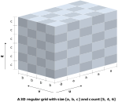
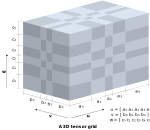

# Grid Structs

Types used to define grid spacing and orientation.
These types are used by grid surfaces, block models, and projected textures.


## OmfOrient2

```c
typedef struct {
    double origin[3];
    double u[3];
    double v[3];
} OmfOrient2;
```

Defines a rotated and translated $(u, v)$ space within the $(x, y, z)$ project space.

### Fields

origin: `double[3]`
: The position of the minimum corner of the grid. Add the [project](project.md) origin too.

u: `double[3]`
v: `double[3]`
: Directions of the $\mathbf{u}$ and $\mathbf{v}$ axes in project space.
Must both be unit vectors, and perpendicular.


## OmfOrient3

```c
typedef struct {
    double origin[3];
    double u[3];
    double v[3];
    double w[3];
} OmfOrient2;
```

Defines a rotated and translated $(u, v, w)$ space within the $(x, y, z)$ project space.

### Fields

origin: `double[3]`
: The position of the minimum corner of the grid. Add the [project](project.md) origin too.

u: `double[3]`
v: `double[3]`
w: `double[3]`
: Directions of the $\mathbf{u}$ and $\mathbf{v}$ axes in project space.
Must all be unit vectors, and all perpendicular to each other.


## OmfRegularGrid2

```c
typedef struct {
    double size[2];
    uint32_t count[2];
} OmfRegularGrid2;
```

Defines a regularly spaced 2D grid.


### Fields

size: `double[2]`
: The size of each grid cell in the $\mathbf{u}$ and $\mathbf{v}$ directions.

count: `uint32_t[2]`
: The number of grid cells in the $\mathbf{u}$ and $\mathbf{v}$ directions.


### Methods

#### omf_regular_grid2_init

```c
OmfRegularGrid2 omf_regular_grid2_init(double du, double dv,
                                       uint32_t nu, uint32_t nv);
```

Initializes or resets a 2D regular grid struct,
setting the size to `{ du, dv }` and the count to `{ nu, nv }`.


## OmfTensorGrid2

```c
typedef struct {
    const OmfArray *u;
    const OmfArray *v;
} OmfTensorGrid2;
```

Defines a tensor spaced 2D grid.


### Fields

u: [`const OmfArray *`](arrays.md#omfarray)
v: [`const OmfArray *`](arrays.md#omfarray)
: Scalar arrays of cell sizes along the $\mathbf{u}$ and $\mathbf{v}$ directions.
All these sizes must be greater than zero.


### Methods

#### omf_tensor_grid2_init

```c
OmfTensorGrid2 omf_tensor_grid2_init(const OmfArray *u, const OmfArray *v);
```

Initializes or resets a 2D tensor grid struct.


## OmfRegularGrid3

```c
typedef struct {
    double size[3];
    uint32_t count[3];
} OmfRegularGrid3;
```

Defines a regularly spaced 3D grid.



### Fields

size: `double[3]`
: The size of each grid cell in the $\mathbf{u}$, $\mathbf{v}$, and $\mathbf{w}$ directions.

count: `uint32_t[3]`
: The number of grid cells in the $\mathbf{u}$, $\mathbf{v}$, and $\mathbf{w}$ directions.

### Methods

#### omf_regular_grid3_init

```c
OmfRegularGrid3 omf_regular_grid3_init(double du, double dv, double dw,
                                       uint32_t nu, uint32_t nv, uint32_t nw);
```

Initializes or resets a 2D regular grid struct,
setting the size to `{ du, dv, dw }` and the count to `{ nu, nv, nw }`.


## OmfTensorGrid3

```c
typedef struct {
    const OmfArray *u;
    const OmfArray *v;
    const OmfArray *w;
} OmfTensorGrid3;
```

Defines a tensor spaced 3D grid.



### Fields

u: [`const OmfArray *`](arrays.md#omfarray)
v: [`const OmfArray *`](arrays.md#omfarray)
w: [`const OmfArray *`](arrays.md#omfarray)
: Scalar arrays of cell sizes along the $\mathbf{u}$, $\mathbf{v}$, and $\mathbf{w}$ directions.
All these sizes must be greater than zero.


### Methods

#### omf_tensor_grid3_init

```c
OmfTensorGrid3 omf_tensor_grid3_init(const OmfArray *u, const OmfArray *v, const OmfArray *w);
```

Initializes or resets a 3D tensor grid struct.
